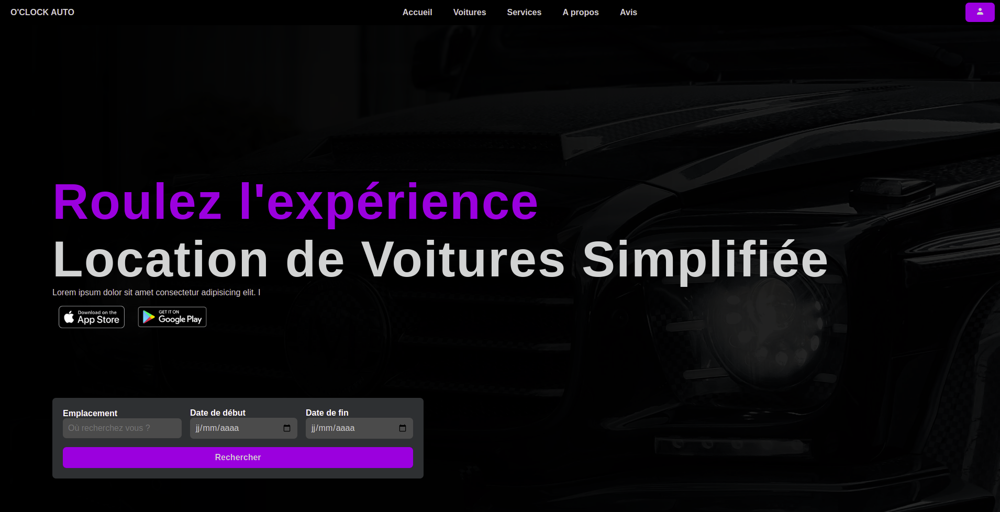

# O clock Auto - Landing Page de Réservation de Voiture

Bienvenue dans le projet O clock Auto, une landing page de réservation de voiture conçue dans le cadre de ma formation au HTML & CSS.

## Aperçu

## Fonctionnalités

- Formulaire de réservation de voiture interactif.
- Design moderne et attractif.
- Adapté aux différentes tailles d'écrans (responsive design).

## Technologies utilisées

- HTML
- CSS

## Comment exécuter le projet

1. Clonez le dépôt localement : `git@github.com:AtticaWebDev/ApprendreCoderConstruireWeb.git`
2. Accédez à la branche souhaitée : `git checkout nom-de-la-branche`
3. Explorez les projets dans le répertoire correspondant.

## Captures d'écran

Ajoutez ici des captures d'écran du projet pour donner un aperçu visuel de l'application.

## Contributions

Les contributions sont les bienvenues ! N'hésitez pas à ouvrir une issue ou à soumettre une pull request.

## Licence

Ce projet est sous licence MIT - voir le fichier [LICENSE](./LICENCE) pour plus de détails.

---

Merci de découvrir O clock Auto ! N'hésitez pas à me contacter pour toute question ou suggestion.
